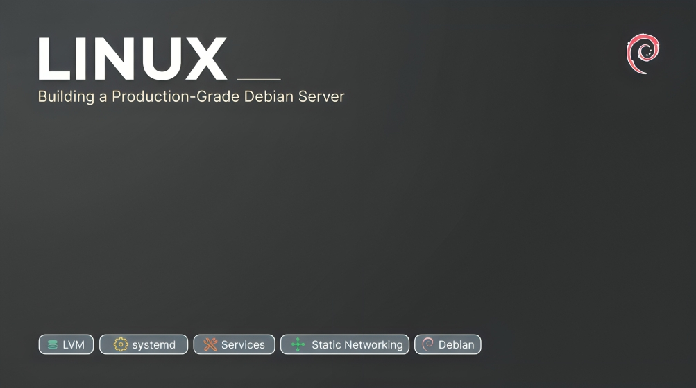
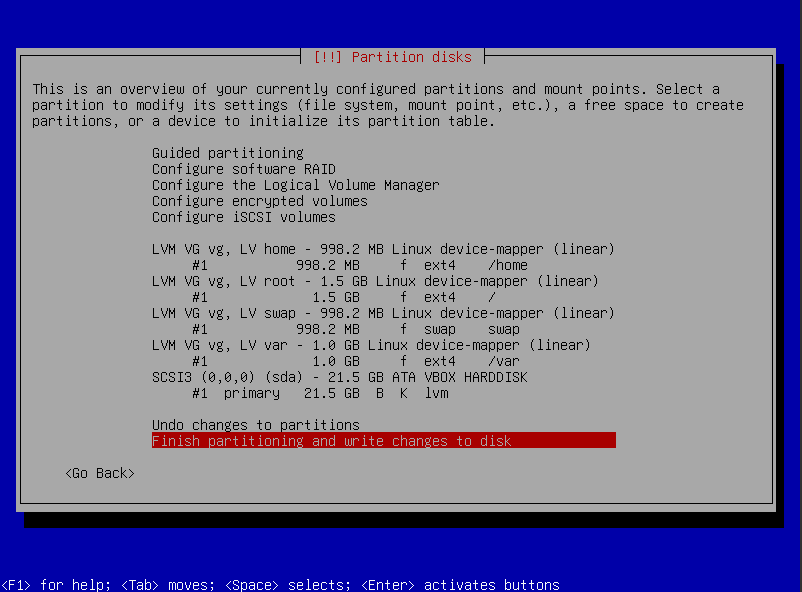
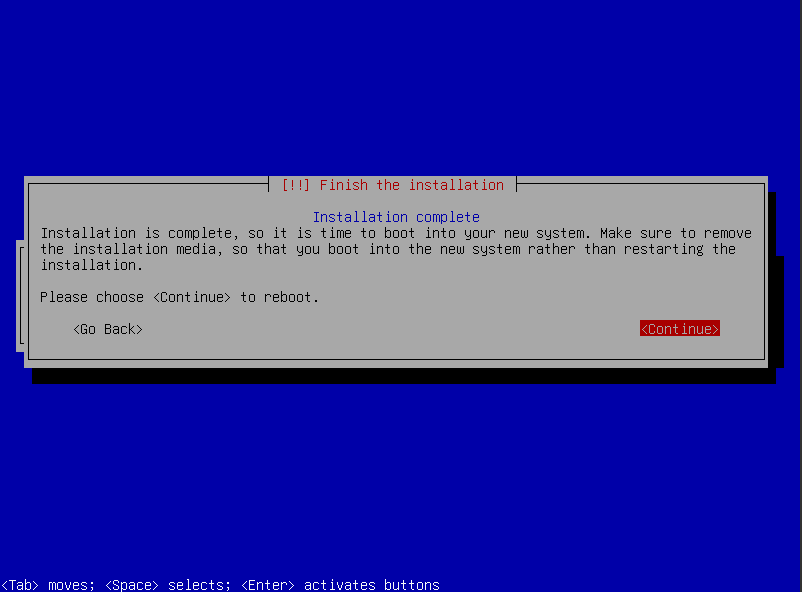
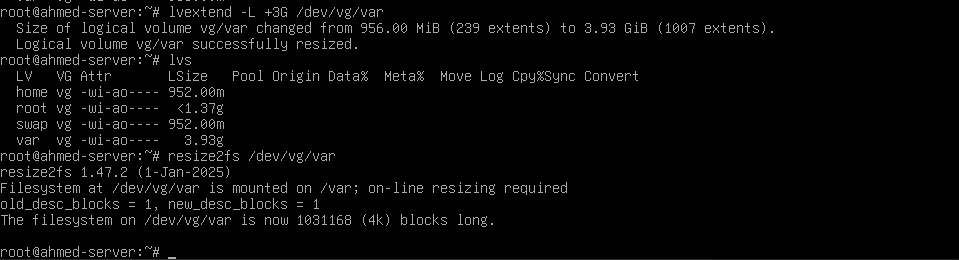
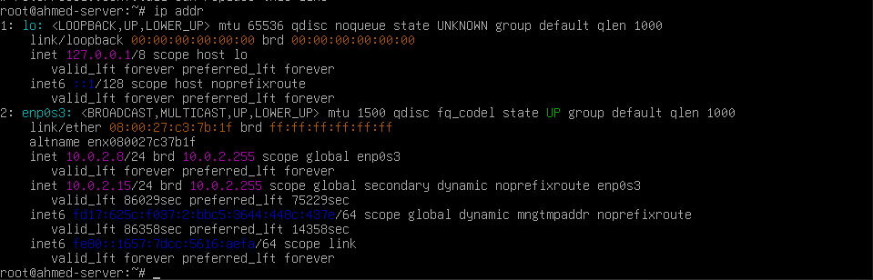
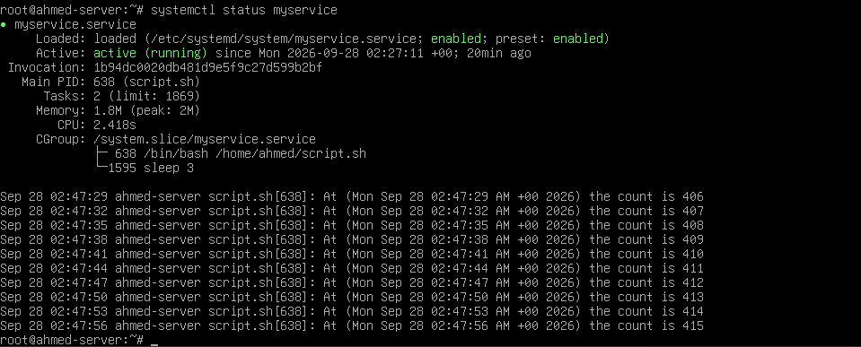
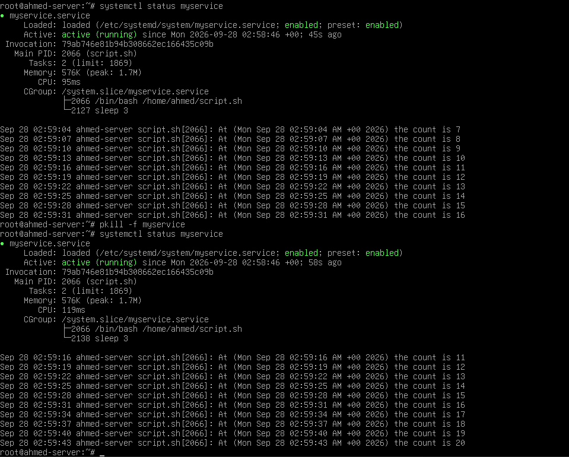

# Linux-Sysadmin
## in this project we are gonna learn how to set up an server with partitions mbr + lvm everything manual



specify the name of the vm
chose the iso image
skip the unattended installation for manual installation
chose the ram and proccesors we need in our vm
confirme our choices
look if you want to change some thing in the settings
run the machine
chose the language
chose the country for time zone and location mirror
chose the the display text
chose the keyboard language
set hostname for the vm
set domain for the vm
set password for theroot
set full name for the user
set username for the user
set password for the user
now the good part the partitioning
first make a pv for the whole disk and so the lvm can manage good
secend make a lvm group that would manage our partitions and we made it to make the size of the partiontions dynamic not static
now we crate our logical volumes /, /home, /var, swap.
our configuration is gonna be based on my size of vm which is 20
/ → 30% = 6 GB
/home → 20% = 4 GB
/var → 20% = 4 GB
swap → 10% = 2 GB
we leave some free space
now we link each logical volumes to a partition as mount points to the logical volumes realated
we finish our partitioning 


chose the mirror that is the closest to you
then chose the proxy if you have one
after this for this project we are gonna chose just standart system utilities
install the boot grub boot loader for better facilities when working on multiple oses on in the same time
chose the disk that you want to install it in
congratulations installtion completed but we still did not finish


to show the partitions you can use ```lsblk```

now we are gonna exend the logical volume to make sure that our lvm is working good

we need sudo so that we can change in the logical volume with the command ```su -```
first we need to see our logical volumes
we can see theme with the commnad ```lvs -o lv_name,lv_size```

and when we say sizes i put the sizes like this based on teh priority adn teh size of every thing
/      → 30% — OS, system files, packages, and configuration.
/home  → 20% — users' personal files and configurations.
/var   → 20% — logs, package caches, and changing application data.
/swap  → 10% — temporary memory when RAM is insufficient.

and we leave some free space in the Volume Group instead of allocating all disk space immediately. This allows us to extend a logical volume later if it becomes full, without having to repartition the disk.

and we can change the size of one with this command to change in the config
```
lvreduce -L +3G /dev/vg/var
```
and this command to change in the file system
```
resize2fs /dev/vg/var
```

now we have completly change teh size of our lv succesfully


now configuring the network in our machine to be static
switch to sudo by ```su -``` se we can switch all what we need in the conf of ip
now to know that we have configured the ip to be static 2 ways of verify the confige or with ip addr to see if the ip changes with the file it self before and after with the command and about the addresses default for debian you can find theme in https://docs.oracle.com/en/virtualization/virtualbox/7.2/user/networkingdetails.html
brief 
VM IP       = 10.0.2.*
Netmask     = 255.255.255.0
Gateway     = 10.0.2.2
DNS         = 10.0.2.3
```
cat /etc/network/interfaces
```
it needs to show the configuration
and you should change it to be like this so if you see it again it should be like this
```
source /etc/network/interfaces.d/*

auto lo
iface lo inet loopback

auto enp0s3
iface enp0s3 inet static
    address 10.0.2.8
    netmask 255.255.255.0
    gateway 10.0.2.2
```
and to apply changes directly you need to run
```
systemctl restart networking
```
or
```
ip link set enp0s3 down
ip link set enp0s3 up
```
now to verify you can run  ping -c 3 8.8.8.8 it should resive data and 0 packet loss


and to set the dns if its not working you need to
change in the file ```/etc/resolve.conf```
to be like this
```
nameserver 10.0.2.3
```

so you can test ping -c 3 google.com and it should not lost packet data

congratulations you have now static ip but we still didnt finish


and after this we should be able to explain on of the services that runs directly on run to make our own service so to list the services we use 
```systemd-analyze blame ```
one of the services is ```ifupdown-pre.service``` which pauses all the proccesses unless it detect the hardware of the network.

so now we need to create our own service which needs to be some thing that like in loop or in general like some thing allways running and does a job

in my example i will do simple script that its job is to count from 1 to infinity unless i stop him every 3 secends

we do it by this ```nano /home/name/script.sh```
and in it it needs to be like this so it runs allways
```
#!/bin/bash

count=1

while true
do
    echo "At ($(date)) the count is $count"
    count=$((count + 1))
    sleep 3
done
```

and we should give the file the permessions with

```chmod 777 /home/name/script.sh```

and now our goal is to make this like server when it dies or craches at 3 am to run again alone so by this we need to controlle to not run it normaly because its gonna stop

we need to controll it by the system daemon systemd

with the commands but wait we need to create our .service first to tell the daemon how is gonna behave
```
systemctl start myservice
systemctl stop myservice
systemctl status myservice
systemctl enable myservice
```

so now we need to create myservice.service in ```/etc/systemd/system``` we can use ```nano /etc/systemd/system```
and we put in it
```
[Service]
ExecStart=/home/ahmed/script.sh
Restart=always

[Install]
WantedBy=multi-user.target
```

and right now after systemctl ```start myservice```
we have like our service succesfully running and if we shut it down is gonna go up again or even if it dose crush its gonna run again


to verify if its gonna work or no ```pkill -f myservice``` to kill our procces but its gonna be still running



so untell here we are finishe d making a server vm fully working and in it a service you can do this with a web app or any service you want i am realy glad you did complete this hero
