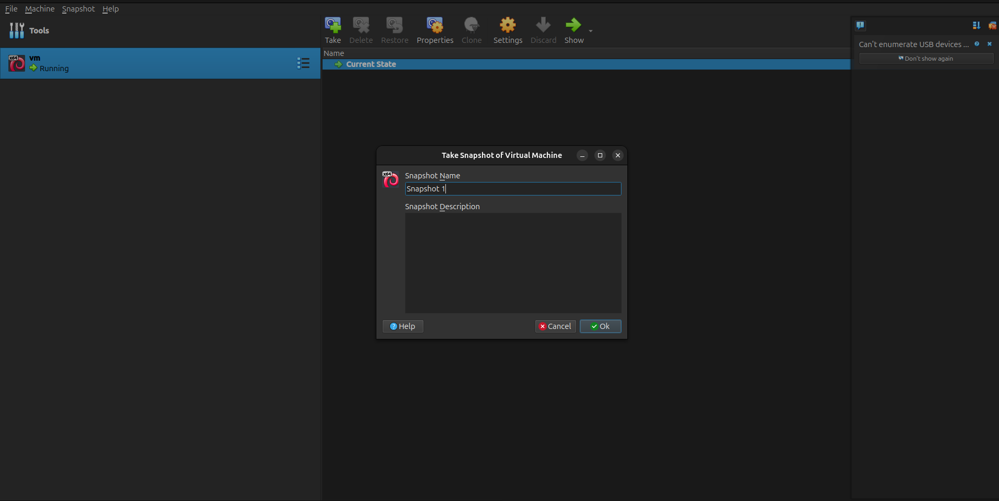

# Linux-Sysadmin

## In this project we are gonna learn how to set up a server with partitions MBR + LVM everything manual


This README is the runbook: following it from top to bottom rebuilds the same machine.

```
linux
├── README.md
├── scripts/myservice.sh
└── systemd/myservice.service
```

After the first boot, every administration command is run as root: log in as `ahmed`, then run `su -`.

install virtual box
install debian from [debian](https://cdimage.debian.org/debian-cd/current/amd64/iso-cd/debian-13.7.0-amd64-netinst.iso)
start a new vm
1. Specify the name of the VM (type Linux, subtype Debian, version Debian 64-bit)
2. Choose the ISO image
3. Skip the unattended installation for manual installation
4. Choose the RAM and processors we need in our VM: 2048 MB RAM and 2 processors. The disk is 20 GB, VDI, dynamically allocated
5. Confirm our choices
6. Look if you want to change something in the settings. Here they must be: System → chipset PIIX3 and "Enable EFI" unchecked (we boot with BIOS + MBR), boot order Optical then Hard Disk. Network → Adapter 1 on NAT
7. Run the machine and choose **Install** (the text installer, not the graphical one)
8. Choose the language (English)
9. Choose the country for timezone and location mirror (Morocco, timezone `Africa/Casablanca`)
10. If the installer asks for a locale, choose `en_US.UTF-8`
11. Choose the keyboard language
12. Set hostname for the VM: `ahmed`
13. Set domain for the VM: leave it empty
14. Set password for the root
15. Set full name for the user
16. Set username for the user: `ahmed`
17. Set password for the user

If you want you can save the snapshot of your VM at any stage of your choice like this:

1. Open VirtualBox Manager.
2. Select your Debian VM.
3. Click Snapshots.
4. Click Take / Take Snapshot.
5. Give it a clear name, for example: `Snapshot 1`



Now the good part, the partitioning. At the "Partition disks" screen choose **Manual**, then:

1. Select the disk `sda` and create a new empty partition table of type **msdos** (MBR).
2. Select `FREE SPACE` → **Create a new partition** → all the space, **Primary**, at the **beginning**. Then set **Use as: physical volume for LVM** and **Bootable flag: on**, and select **Done setting up the partition**. This is the PV for the whole disk so the LVM can manage it, and it is the only real partition of the disk. (The bootable flag is only a convention on MBR, GRUB starts the boot anyway.)
3. Select **Configure the Logical Volume Manager**, answer **Yes** to write the changes, then **Create volume group**, name it `vg` and select `/dev/sda1`. This volume group is the pool that makes the size of the volumes dynamic, not static.
4. Select **Create logical volume** four times in `vg`: `root`, `home`, `var`, `swap`, with the sizes of the table below. Do not allocate the rest of the space.

Layout for a 20 GB virtual disk (about 10 GB is left unallocated in the volume group):

| Volume | Size | Mount |
|---|---|---|
| `vg-root` | 5 GB | `/` |
| `vg-home` | 2 GB | `/home` |
| `vg-var`  | 2 GB | `/var` |
| `vg-swap` | 1 GB | swap |

The installer counts in GB and LVM displays GiB, so a 5 GB volume shows as 4.7G in `lsblk`.

Why each size, and what happens when it is full:

- `/` (5 GB): the OS, installed packages and `/etc`. A minimal install uses about 2 GB (check with `df -h /`),
  and nothing here grows by itself, so the rest is headroom for packages. If `/` fills, nothing can be
  written on it: `apt` cannot unpack packages, config files cannot be saved and logins can fail.
  That is why data that grows is kept off `/`.
- `/home` (2 GB): users' files. If it fills, only users writing there are affected: they cannot save files.
  The OS and its logs keep working. That is the reason for a separate volume.
- `/var` (2 GB): logs and the journal, the apt cache, the package database and service data. This grows over
  time, so it is the volume most likely to fill. If it fills, `journald` stops storing logs, `apt` cannot
  download packages, `dpkg` can stop halfway through an installation, and services that keep state in
  `/var/lib` fail. `journald` limits itself to about 10% of the volume, so the journal alone
  cannot fill it. This is the first volume I would grow.
- swap (1 GB): overflow when RAM is full. It slows the machine down but keeps processes alive. If RAM and swap
  are both full, the kernel's OOM killer kills processes. It is small because a server that depends on swap
  needs more RAM, not more swap.
- Free space in the VG (about 10 GB): extents that belong to no volume, so any volume can be grown later
  with `lvextend`.

5. Back in the partitioner, give each logical volume its use and its mount point: `root` → Ext4 mounted on `/`, `home` → Ext4 mounted on `/home`, `var` → Ext4 mounted on `/var`, `swap` → **swap area**. The logical volumes are not linked to partitions: they are formatted and mounted directly.
6. Select **Finish partitioning and write changes to disk**.


7. Choose the mirror that is the closest to you (`deb.debian.org` is a safe choice). Scan extra installation media: No
8. Then choose the proxy if you have one, otherwise leave it empty
9. After this for this project we are gonna choose just standard system utilities: untick everything else (the desktop environment, GNOME and SSH server are ticked by default), keep only "standard system utilities"
10. Install the GRUB boot loader, it is what starts the system, and choose the disk `/dev/sda`

Congratulations, installation completed but we still did not finish.


After the reboot the machine shows a text `login:` prompt, without any graphical session, and no desktop environment is installed because we only chose standard system utilities.

To show the partitions you can use:
```bash
lsblk
```
### Disk & Partition Layout (`lsblk`)

```text
ahmed@ahmed:~$ lsblk
NAME        MAJ:MIN RM   SIZE RO TYPE MOUNTPOINTS
sda           8:0    0    20G  0 disk 
└─sda1        8:1    0    20G  0 part 
  ├─vg-root 254:0    0   4.7G  0 lvm  /
  ├─vg-home 254:1    0   1.9G  0 lvm  /home
  ├─vg-var  254:2    0   1.9G  0 lvm  /var
  └─vg-swap 254:3    0   952M  0 lvm  [SWAP]
sr0          11:0    1  1024M  1 rom  
```

Now we are gonna extend the logical volume to make sure that our LVM is working good:

1. We need root so that we can change in the logical volume, with the command:
```bash
su -
```

2. First we need to see our logical volumes. We can see them with the command:
```bash
lvs
```
And the out put should be
### Logical Volumes (`lvs`)

```text
root@ahmed:~# lvs
  LV   VG Attr       LSize   Pool Origin Data% Meta% Move Log Cpy%Sync Convert
  home vg -wi-ao----  <1.86g                                                    
  root vg -wi-ao----  <4.66g                                                    
  swap vg -wi-ao---- 952.00m                                                    
  var  vg -wi-ao----  <1.86g                                                    
```

We leave some free space in the Volume Group instead of allocating all disk space immediately. This allows us to extend a logical volume later if it becomes full, without having to repartition the disk. We grow later instead of guessing big at the beginning because ext4 can grow while it is mounted (`lvextend` then `resize2fs`), but it can only shrink after an unmount, and XFS cannot shrink at all. Free extents can go to any volume, but space already given to a volume stays there.

3. And we can change the size of one with this command to grow the logical volume:
```bash
lvextend -L +3G /dev/vg/var
```

4. And this command to grow the file system, while it is still mounted (it prints the new size of the file system):
```bash
resize2fs /dev/vg/var
```

5. Now we check the new size of the logical volume with `lvs` or `lsblk`: `var` went from 1.86g to about 4.86g, and the data on it is untouched because nothing was unmounted or moved.

Now we have completely changed the size of our LV successfully.


Now configuring the network in our machine to be static:

1. Become root with `su -` so we can change all what we need in the conf of IP.

Now to know that we have configured the IP to be static, 2 ways of verifying the config: with `ip addr` to see if the IP changes (before it shows the DHCP address 10.0.2.15, after it shows 10.0.2.8), and with the file itself before and after with the command. And about the default addresses for Debian you can find them in:
https://docs.oracle.com/en/virtualization/virtualbox/7.2/user/networkingdetails.html

In brief:
- VM IP       = 10.0.2.*
- Netmask     = 255.255.255.0
- Gateway     = 10.0.2.2
- DNS         = 10.0.2.3

2. Check the interfaces file:
```bash
cat /etc/network/interfaces
```
It needs to show the configuration.

3. And you should change it to be like this so if you see it again it should be like this:
```
source /etc/network/interfaces.d/*

auto lo
iface lo inet loopback

auto enp0s3
iface enp0s3 inet static
    address 10.0.2.8
    netmask 255.255.255.0
    gateway 10.0.2.2
```

4. And to apply the changes directly you need to run:
```bash
systemctl restart networking
```

5. Now to verify you can run:
```bash
ip addr
ping -c 3 8.8.8.8
```
`ip addr` shows 10.0.2.8 on `enp0s3`, and the ping should receive data and 0 packet loss.

6. And to set the DNS, the file `/etc/resolv.conf` must be like this (the file is named `resolv.conf`), if not, change it:
```
nameserver 10.0.2.3
```

7. So you can test that the name is resolved and the internet is reached:
```bash
ping -c 3 deb.debian.org
```
And it should not lose packet data.

Congratulations, you have now static IP but we still didn't finish.


And after this we should be able to explain one of the services that runs directly on boot to make our own service. So to list the services we use:
```bash
systemd-analyze blame
```
```text
21ms systemd-user-sessions.service
20ms systemd-sysctl.service
20ms ifupdown-pre.service
15ms tmp.mount
14ms user-runtime-dir@1000.service
11ms systemd-tmpfiles-setup-dev.service
```

One of the services is `ifupdown-pre.service`. It is a helper that holds back `networking.service` until udev has finished detecting and naming the network hardware, because configuring `enp0s3` before it exists would fail. It takes time because it waits for the virtual network card to be detected, it does not compute anything.

The difference between `enabled` and `active`: `enabled` means the unit starts at boot (`systemctl enable` links it into `multi-user.target`), `active` means it is running now. They are independent: a service started with `start` is active but not enabled (it is gone after a reboot), and a stopped service can still be enabled (it comes back at the next boot). `systemctl status myservice` shows both: `enabled` on the `Loaded` line and `active (running)` on the `Active` line.

So now we need to create our own service, which needs to be something that is like in a loop or in general like something always running and does a job.

In my example, I will do a simple script that its job is to count from 1 to infinity unless I stop it, every 3 seconds.

1. We do it by this:
```bash
nano /home/ahmed/myservice.sh
```
And in it, it needs to be like this so it runs always:
```bash
#!/bin/bash

count=1

while true
do
    echo "At ($(date)) the count is $count"
    count=$((count + 1))
    sleep 3
done
```

2. And we should give the file the permissions with:
```bash
chmod 755 /home/ahmed/myservice.sh
```

And now our goal is to make this like a server when it dies or crashes at 3 am to run again alone. So by this we need to control to not run it normally because it's gonna stop.

We need to control it by the system daemon systemd.

With the commands, but wait, we need to create our .service first to tell the daemon how it is gonna behave:
```bash
systemctl start myservice
systemctl stop myservice
systemctl status myservice
systemctl enable myservice
```

3. So now we need to create `myservice.service` in `/etc/systemd/system`. We can use:
```bash
nano /etc/systemd/system/myservice.service
```
And we put in it:
```ini
[Unit]
Description=myservice - counts from 1 to infinity, one line every 3 seconds

[Service]
ExecStart=/home/ahmed/myservice.sh
Restart=always
StandardOutput=journal
StandardError=journal

[Install]
WantedBy=multi-user.target
```

`Restart=always` restarts the process whenever it stops, whether it exited cleanly, crashed or was killed. `WantedBy=multi-user.target` is what `enable` links into the boot, and `StandardOutput=journal` sends the output to the journal.

4. And right now, we start the service and we enable it so it starts at boot:
```bash
systemctl start myservice
systemctl enable myservice
```

5. We check that it is both enabled and active:
```bash
systemctl status myservice
```
We have like our service **successfully running** (`enabled` on the `Loaded` line and `active (running)` on the `Active` line, with its Main PID and its last output lines, which come from the journal), and if we shut it down it's gonna go up again or even if it does crash it's gonna run again.

6. To verify if it's gonna work or no, we kill our process (`kill` sends SIGTERM like a plain `kill`, which systemd counts as a clean exit, so only `Restart=always` brings it back) and we check the status again:
```bash
systemctl show --property MainPID --value myservice
kill <PID>
systemctl status myservice
```
The service is `active (running)` again, with a new Main PID.

So until here we are finished making a server VM fully working and in it a service. You can do this with a web app or any service you want. I am really glad you did complete this hero!